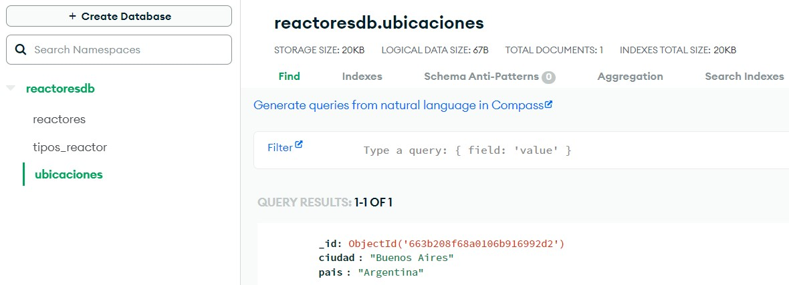
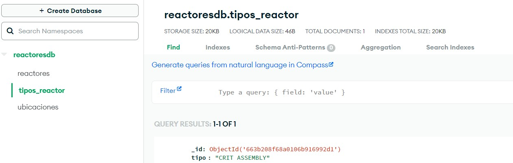
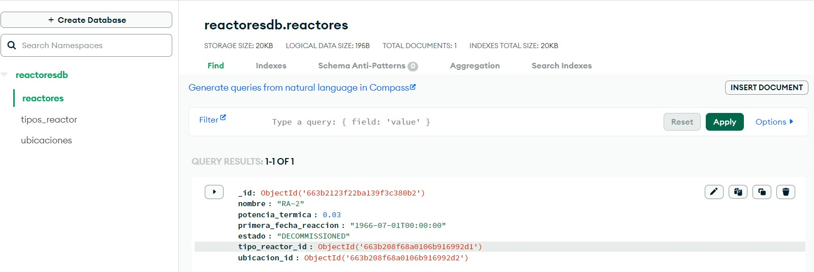
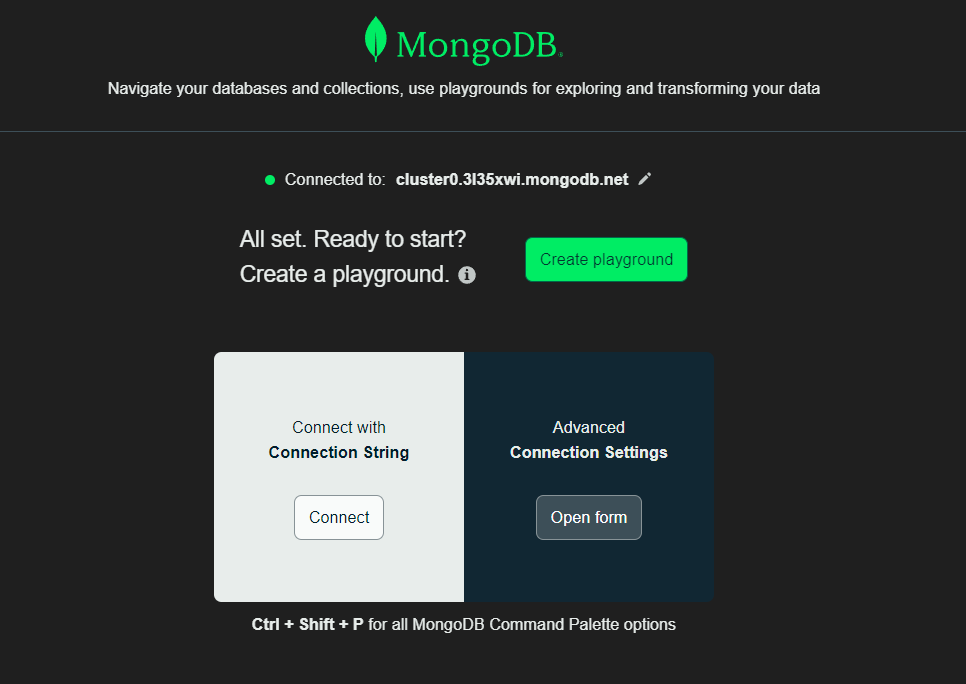

# Api en python con MongoDB

# Importante
Este proyecto se realizó utilizando el lenguaje de programación Python y el Motor de Base de datos MongoDB
- Con python se utilizaron librerías como FastAPI para la creación de la API, pymongo para la interacción con la base de datos Mongodb.

# Estructura de Carpetas del Proyecto

- **project/app/**
  - **context/**: Contiene la clase Session, define la configuración y la gestión del contexto de la aplicación, incluida la conexión a la base de datos.
  - **Controller/**: Contiene los controladores de la aplicación, que manejan las rutas y las solicitudes HTTP.
  - **model/**: Contiene las definiciones de los modelos de datos de la aplicación.
    - **model/reactor_schema.py**: Son los modelos con los cuales van a retornar las consultas que realice el usuario.
    - **model/reacto.py**: Es la definición del ORM para realizar el mapeo de las tablas.
  - **repositories/**: Contiene los repositorios que interactúan con la base de datos.
  - **service/**: Contiene los servicios que implementan la lógica de negocio de la aplicación.
  - **context.py**: Define la configuración y la gestión del contexto de la aplicación, incluida la conexión a la base de datos.
- **README.md**: Archivo de documentación que proporciona información sobre el proyecto, cómo configurarlo, ejecutarlo y usarlo.
- **.gitignore**: Archivo que especifica qué archivos y directorios deben ser ignorados por Git durante el versionado del proyecto.

## **.env** y Conexion a MongoDB

Archivo que contiene variables de entorno para la configuración local del proyecto, como claves secretas, configuraciones de la base de datos, etc.
En este caso se almaceno una variable de entorno llamada **uri** que tiene la siguiente estructura

```python
uri = "mongodb+srv://<username>:<password>@cluster0.3l35xwi.mongodb.net/?retryWrites=true&w=majority&appName=Cluster0"
```

## Datos
1. **Crear Uuarios**

Esto se hace con el fin de mantener lo mayormente seguro el entorno de desarrollo
  

2. **Crear la Base de datos y a su vez las colecciones**

  a. coleccion ubicaciones
  

  b.  coleccion tipos
  

  c. coleccion reactores
  


## Conexion usando MongoDB y Visual

Se usa la extensión en visual studio code llamada MongoDB for VS code


# Creacion de la coleccion y validaciones

El script para la creación de las colecciones y los esquemas de validaciones se encuentran en la ruta project/Validations


# Ejecucion PY

Tener en cuenta la instalación de python y sus complementos

1. Crear el entorno virtual:
- instalar pipenv: pip install pipenv
- python -m pipenv shell o pipenv shell

2. Importar las siguientes librerías en el entorno virtual:

  ```python

pip install fastapi pydantic pymongo[srv] uvicorn

  ```
  
3. Ejecutar la app:

```python

uvicorn project.app.controllers.reactor_controller:app

```

# Resultados
Se deja el archivo de word "PruebasResultadosEndpoints.docx" el cual se puedes descargar y evidenciar capturas de los resultados
